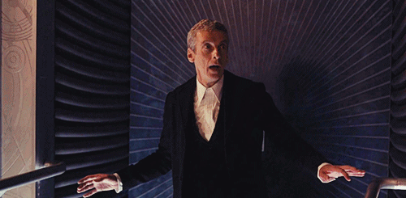

# Hello There!

  
  

    I'm Kevson Filipe, I'm glad you're here. I live in Brasilia, Brazil. I am a software developer, computer technician and admirer of the best of Science and Technology. I am present in the HospTup, Kowworking projects and I am part of the Underground Devs initiative.
  

  

    Below are some repositories that I consider crucial in my learning, if you want to see more of them, go to the repositories tab there are projects I developed during a crisis of boredom and quick codes for reuse.
  

  

    If you want to talk about science, technology, entrepreneurship, series, movies and music these are my social networks.
  

  
  
  
  
  
  

- - -

  
  

